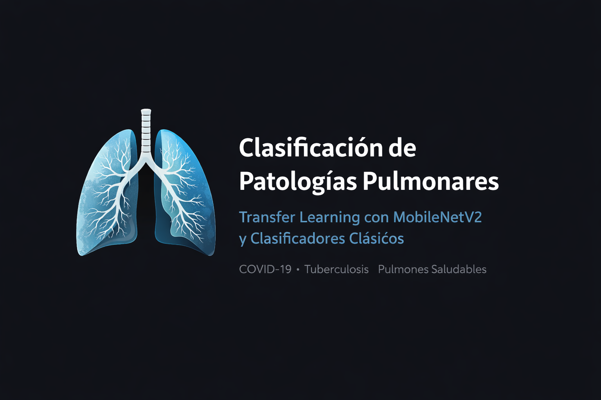

<p align="center">
  
</p>

# Clasificación de Patologías Pulmonares mediante Transfer Learning y Métodos Clásicos

Este proyecto implementa un sistema de diagnóstico asistido para la
detección de **COVID-19**, **Tuberculosis** y pulmones **Saludables**.
La solución utiliza la arquitectura **MobileNetV2** (pre-entrenada en
ImageNet) como un extractor de características de alto nivel,
transformando imágenes médicas en vectores matemáticos densos para su
posterior clasificación.

------------------------------------------------------------------------

## Contexto y Motivación

La interpretación de radiografías de tórax es una tarea crítica que
puede verse afectada por la fatiga visual. Este software busca:

-   **Detección temprana:** Crucial para evitar consecuencias fatales en
    enfermedades respiratorias.
-   **Segunda opinión confiable:** Un sistema validado con una precisión
    superior al 97%.

------------------------------------------------------------------------

## Metodología Técnica

### 1. Preprocesamiento y Normalización

Para garantizar la consistencia en el aprendizaje, se aplicaron las
siguientes técnicas:

-   **Escala de grises:** Las imágenes fueron normalizadas en blanco y
    negro para resaltar densidades tisulares y eliminar información de
    color irrelevante.
-   **Recorte focalizado (cropping):** Se realizó un ajuste manual
    hacia la región torácica para eliminar ruido visual
    periférico.

------------------------------------------------------------------------

#### 1.1. Dataset y Preprocesamiento

El modelo fue entrenado utilizando una **compilación personalizada de múltiples datasets públicos**, seleccionados por su diversidad clínica y calidad en radiografías de tórax. Esta integración permitió mejorar la robustez del sistema y su capacidad de generalización frente a distintos patrones patológicos.

##### Nota de Ingeniería

Se aplicó un **proceso de recorte focalizado (cropping)** sobre la región torácica de cada imagen.
Esta estrategia fuerza al modelo a concentrarse exclusivamente en las **texturas, densidades y patrones morfológicos del parénquima pulmonar**, eliminando información visual periférica irrelevante. Como resultado, se obtuvo una **mejora significativa en la precisión y estabilidad del modelo**, especialmente en la diferenciación entre patologías de apariencia similar.

##### Datasets Utilizados

- **[https://www.kaggle.com/datasets/tawsifurrahman/covid19-radiography-database]**
- **[https://www.kaggle.com/datasets/prashant268/chest-xray-covid19-pneumonia]**
- **[https://www.kaggle.com/datasets/tawsifurrahman/tuberculosis-tb-chest-xray-dataset]**
- **[https://www.kaggle.com/datasets/yasserhessein/tuberculosis-chest-x-rays-images]**


------------------------------------------------------------------------

### 2. Extracción de Características (Feature Extraction)

Se utilizó **MobileNetV2** sin su capa de clasificación final
(`include_top=False`):

-   **Estrategia:** El modelo base se mantuvo congelado para preservar
    los pesos de ImageNet.
-   **Vectores densos:** Se aplicó una capa de `GlobalAveragePooling2D`
    para reducir los mapas de características espaciales.
-   **Dimensión de salida:** El resultado final de este proceso es un
    **vector denso de 1280 dimensiones** por cada imagen, el cual
    captura la esencia morfológica de la radiografía de forma compacta y
    eficiente.

------------------------------------------------------------------------

## Resultados y Comparativa de Modelos

Los vectores densos de 1280 dimensiones se utilizaron como entrada para
tres clasificadores clásicos. El rendimiento se evaluó en un set de
prueba de **560 imágenes**.

| Algoritmo          | Accuracy | Precision (Prom.) | F1-Score (Prom.) |
|--------------------|----------|-------------------|------------------|
| **SVM (SVC)**      | 0.9768   | 0.98              | 0.98             |
| **Random Forest**  | 0.9750   | 0.97              | 0.97             |
| **KNN**            | 0.9411   | 0.94              | 0.94             |


### Análisis del Mejor Modelo (SVM)

El modelo de **Máquinas de Soporte Vectorial (SVM)** destacó por su
capacidad de generalización en vectores de alta dimensionalidad:

-   **COVID-19:** Precision 0.95 / Recall 0.99\
-   **Tuberculosis:** Precision 0.99 / Recall 0.98 (F1-Score: 0.99)

------------------------------------------------------------------------

## Requisitos e Instalación

-   **Python:** 3.10.19\
-   **Node.js:** v22.21.1\
-   **npm:** 10.9.4

### Configuración de Entornos (Conda)

``` bash
# Entorno para entrenamiento y extracción de características
conda env create -f general.yml

# Entorno para el backend y visualización gráfica
conda env create -f grafico.yml

# Instalación de dependencias de Node.js
cd ../frontend && npm install
```

------------------------------------------------------------------------

## Ejecución de la implementación

Una vez configurados los entornos y dependencias, el sistema puede ejecutarse de forma local siguiendo los pasos descritos a continuación.  
La arquitectura se encuentra separada en **backend** y **frontend**, los cuales deben iniciarse de manera independiente.

### Backend

El backend expone los servicios de inferencia y procesamiento mediante una API desarrollada con **FastAPI**.

> Por defecto, el backend se ejecutará en modo desarrollo con recarga automática ante cambios en el código.

#### Pasos para iniciar el servidor

```bash
cd backend/
uvicorn app.main:app --reload
```

### Backend

La interfaz de usuario está desarrollada con tecnologías web modernas y se encarga de la carga de radiografías y visualización de resultados.

> Una vez iniciado, la aplicación estará disponible en el navegador a través de la URL indicada en la consola.

#### Pasos para iniciar el servidor

```bash
cd frontend/
npm run dev
```


------------------------------------------------------------------------

## Estructura del Proyecto

-   **/src**: Scripts de extracción de vectores (1280 dimensiones) y
    entrenamiento.
-   **/backend**: Lógica de servidor en Node.js para procesamiento de
    inferencias.
-   **/frontend**: Interfaz de usuario para carga de radiografías.


------------------------------------------------------------------------

## Colaboradores

Proyecto desarrollado por:

-   **\[Kevin Merlin Cabrera Coyotzi\]** - \[https://github.com/WPA-PROGRAMMING\]\
-   **\[Dulce Anahí Luna García\]** - \[https://github.com/Dulce-Luna\]
